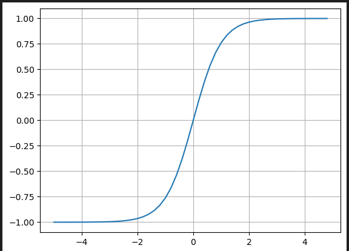

# Learning about LLMs

Playground project to learn about LLMs.

### Sources:

- [Andrej Karpathy's makemore project](https://www.youtube.com/watch?v=PaCmpygFfXo)

### Prerequisites:

- Python Jupyter Notebook
- Pytorch
- Matplotlib

## Table of Contents

### LLMs

- [Bigram LLM](./bigramllm.ipynb)
  - The main idea is to get a count of character pairs which occur in the text.
  - Arrange the dataset of the text so that the character pairs per letter are row-wise and column-wise (the second char in the pair in the col is the first char in the row)
  - Get a probability of a letter following another letter based on the character pairs in a row (Char Pair for a letter / Total Count of Char pair occurences for that letter)
  - repeat the loop since the column selected lines up with the starting char of the next pair by row index (repeat loop on that row)
- [Bigram LLM built with a Neural Network](./bigrams_neuralnetwork.ipynb)

### Neural Networks

- [Neural Networks](./NeuralNetworks/)
  - Following [Andrej Karpathy's building micrograd](https://www.youtube.com/watch?v=VMj-3S1tku0&list=PLAqhIrjkxbuWI23v9cThsA9GvCAUhRvKZ)
  - [Derivatives](./NeuralNetworks/derivatives.ipynb)
  - [Notebook](./NeuralNetworks/micrograd.ipynb)
    - Back Propagation using the Chain Rule

## Architecture of a Neural Network

- Made up of inputs, weights and bias that are inputs to layers of Neurons

### Primary Components of a Neuron:

[Visual Model of a Neuron](https://cs231n.github.io/neural-networks-1/)

- $x_n$: Inputs to the neuron
- $w_n$: Weights (on the synapses)
- Processing in the Neuron: The set of weights multiplied by their corresponding inputs with a bias

  - what flows to the neuron are the multiple sets of inputs multiplied by the weights: $w_1 \times x_1, w_2 \times x_2, \ldots, w_n \times x_n$
  - Added to this is some bias $b$ which can be used to adjust the sensitivity or "trigger happiness" of the neuron regardless of the input.
    $$\sum_n w_n x_n + b$$
  - The product of the inputs, weights with the bias is piped to an Activation Function

    - The Activation Function is usually a [squashing function](https://en.wikipedia.org/wiki/Hyperbolic_functions) of some kind (Sigmoid or Tanh)
    - The squashing function squashes so that the output plateaus and caps smoothly at 1 or -1 (as the inputs are increased or decreased from zero):

      

  - The output of the neuron is the Activation function applied to the dot product of the weights/inputs+bias:
    $$f\left(\sum_n x_n w_n + b\right)$$

### Layer of Neurons

[Python Notebook](./NeuralNetworks/micrograd.ipynb)

- A set of Neurons evaluated independently

  - Each neuron in a layer is not connected to each other, but are connected to all other neurons or inputs in adjacent layers.

    

### Multi-Layer Perceptron (MLP)

- A network with multiple Layers of Neurons
- The Layers feed into each other sequentially (in order)
