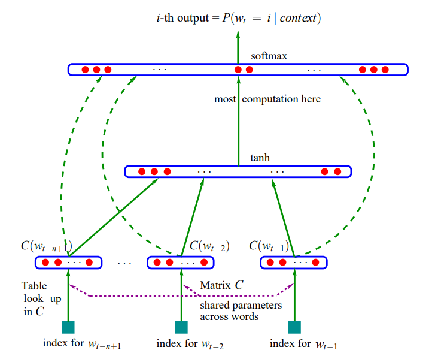

# Makemore video 2 by Andrej Karpathy

- [Video](https://www.youtube.com/watch?v=TCH_1BHY58I&list=PLAqhIrjkxbuWI23v9cThsA9GvCAUhRvKZ&index=3)
- Explanation of high level approach at timestamp 6:00
- [Python Notebook Implementation](./NeuralNetworks/makemore2.ipynb)

### Architecture

 

- Each word has 30 dimensions in a neural network layer (30 numbers per word)
- $C$ is a matrix of the 17,000 possible words in the set which are the rows and the columns are the 30 dimensions
- The top layer has 17,000 neurons which are all connected to the Hop Hidden layer (see below)
- Hop Parameter
  - Hidden layer in the NN - spoken about at timestamp 7:07
  - Has multiple choices (size is any size) to evaluate how each one works well or not
- Everything in the top softmax layer is exponentiated and normalized (max value of 1) to make it a distribution of probabilities
